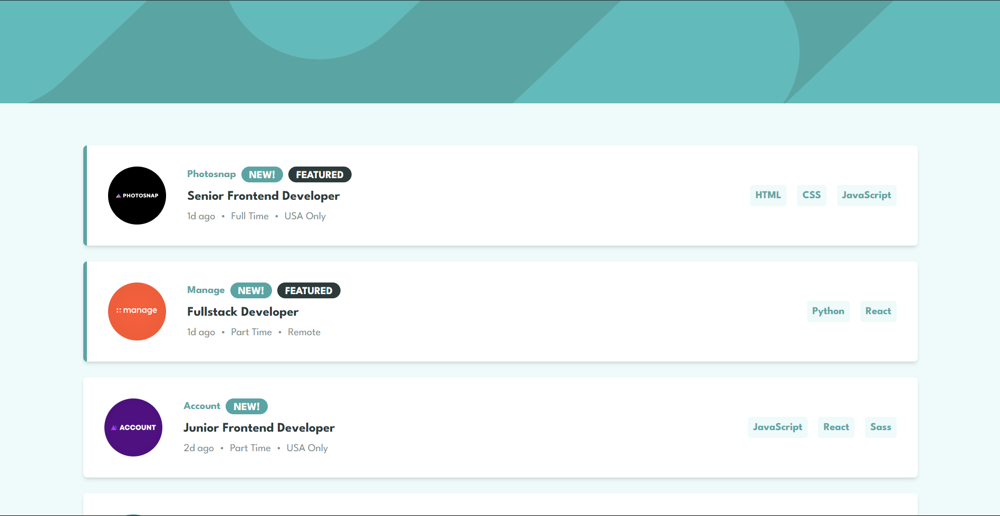

# Frontend Mentor - Job listings with filtering solution

This is a solution to the [Job listings with filtering challenge on Frontend Mentor](https://www.frontendmentor.io/challenges/job-listings-with-filtering-ivstIPCt). Frontend Mentor challenges help you improve your coding skills by building realistic projects. 

## Table of contents

- [Overview](#overview)
  - [The challenge](#the-challenge)
  - [Screenshot](#screenshot)
  - [Links](#links)
- [My process](#my-process)
  - [Built with](#built-with)
  - [What I learned](#what-i-learned)
  - [Continued development](#continued-development)
  - [Useful resources](#useful-resources)
- [Author](#author)
- [Acknowledgments](#acknowledgments)

**Note: Delete this note and update the table of contents based on what sections you keep.**

## Overview

### The challenge

Users should be able to:

- View the optimal layout for the site depending on their device's screen size
- See hover states for all interactive elements on the page
- Filter job listings based on the categories

### Screenshot




### Links

- Solution URL: [https://github.com/the-bipu/job-listing-aurelia](https://github.com/the-bipu/job-listing-aurelia)
- Live Site URL: [https://job-listing-aurelia.vercel.app/](https://job-listing-aurelia.vercel.app/)

## My process

### Built with

- Semantic HTML5 markup
- CSS custom properties
- Flexbox
- CSS Grid
- Mobile-first workflow
- [Aurelia](https://aurelia.io/) - JS library
- [Tailwind](https://tailwindcss.com/) - For styles

### What I learned

The js part for this project feels familiar. as i've done some of others frameworks and library of js this kind of code structure which give more readability feels comfortable to write.

```js
public logItem(item: string, type: 'language' | 'tool'): void {
    const exists = this.clickedItems.some(
      clickedItem => clickedItem.item === item && clickedItem.type === type
    );

    if (!exists) {
      this.clickedItems.push({ item, type });
    }
  }

  public removeItem(clickedItem: { item: string, type: string }): void {
    this.clickedItems = this.clickedItems.filter(
      item => item.item !== clickedItem.item || item.type !== clickedItem.type
    );
  }

  public removeAllItems(): void {
    this.clickedItems.splice(0, this.clickedItems.length);
  }  

  public get filteredData() {
    if (this.clickedItems.length === 0) {
      return this.data;
    }

    return this.data.filter(card => {
      return this.clickedItems.every(clickedItem => {
        if (clickedItem.type === 'language') {
          return card.languages.includes(clickedItem.item);
        } else if (clickedItem.type === 'tool') {
          return card.tools.includes(clickedItem.item);
        }
        return false;
      });
    });
  }
```

### Continued development

I would like to add localstorage in this project for storing the tags so that when opening the app next time it can store my tags using browsers localStorage.

### Useful resources

- [Example resource 1](https://www.example.com) - This helped me for XYZ reason. I really liked this pattern and will use it going forward.
- [Example resource 2](https://www.example.com) - This is an amazing article which helped me finally understand XYZ. I'd recommend it to anyone still learning this concept.

## Author

- Github - [The-Bipu](https://github.com/the-bipu)
- Frontend Mentor - [@the-bipu](https://www.frontendmentor.io/profile/the-bipu)

## Acknowledgments

Thankyou Aurelia Community + ChatGpt for helping me out in this project. 😁💫